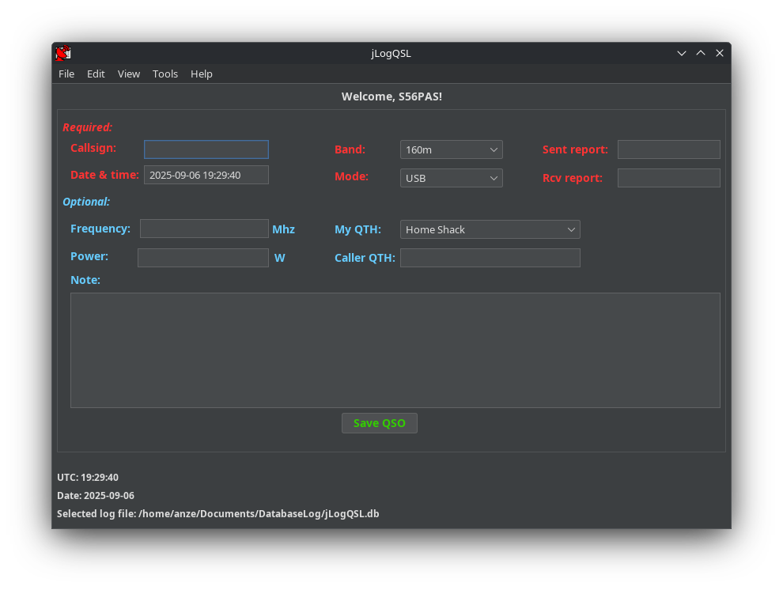

# jLogQSL

jLogQSL is an amateur radio contact logging software written in Java Swing.

⚠️ **Work in Progress:** Some features are still missing, and bugs may be present.  
The **first stable release** will be made once all of the listed features are complete.

#### Missing features:
- Statistics 

#### Later implementation:
- Documentation/Manual

## Requirements
- **Java** (JDK 8 or higher)

## Platforms
- Works on **all platforms** that support Java (Windows, macOS, Linux)

## Pictures

